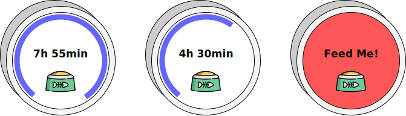

# ChronoClick

> [!NOTE]
> Currently the project is still in the requirement and concept phase!

## Overview

**ChronoClick** is a compact, user-friendly, and versatile reminder device designed to help users stay on top of routine tasks like watering plants, feeding pets, or taking medication. Powered by a CR2032 battery, the device features a full color display that counts down and counts up time, providing a simple yet effective way to track when an action is due or overdue.

## Project Goals
The primary aim of this project is to establish a comprehensive framework for hardware and software development, starting from the initial concept and progressing through every stage. It will encompass all essential steps, including conceptual design, requirements engineering, system development, software engineering and the integration of automated testing processes. This project is designed to serve as a baseline, to successfully develop a hardware system from the ground up.

## Features
- **Countdown Timer:** Set a custom countdown to track time for any task.
- **One-Click Reset:** Simply press the button to reset the timer and start the countdown again.
- **NFC Communication:** To configure the device and upload custom icons using any phone.
- **Full color reflective LCD:** The button changes color when the countdown reaches zero, providing a clear, visual alert.
- **1 Year Battery Life:** Powered by a CR2032 coin cell.

## Open Source
Everything is open source and available for free use under the [GPL-3.0 License](https://github.com/l-jost/ChronoClick/blob/main/LICENSE.md). Please note that it is provided without any warranty.
