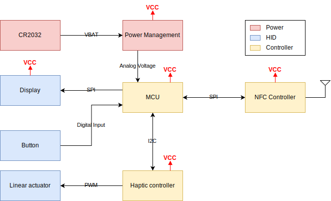

# Design Concept

## Table of Contents
- [Concept](#concept)
- [Button](#button)
- [Block Diagram](#block-diagram)
- [Feasibility](#feasibility)
    - [Power](#power)
        - [Battery](#battery)
        - [Microcontroller](#microcontroller)
        - [Display](#display)
        - [Power Conversion](#power-conversion)
        - [Typical Operation](#typical-operation)
        - [Runtime Estimation](#runtime-estimation)

## Concept

**ChronoClick** is a compact, user-friendly, and versatile reminder device designed to help users stay on top of routine tasks like watering plants, feeding pets, or taking medication. Powered by a CR2032 battery, the device features a full color display that counts down and counts up time, providing a simple yet effective way to track when an action is due or overdue.

### Button
| Feature | Physical Button | Capacitive Button with Haptic Motor |
|---------|-----------------|-------------------------------------|
| **Tactile Feedback** | Immediate, mechanical feedback | Customizable haptic feedback |
| **Power Consumption** | Low power consumption | Higher power consumption due to sensor and motor |
| **Complexity** | Simple circuitry, but very difficult mechanical design to guide housing and making it feel good | More complex circuitry, quite easy mechanical design |

We should not use a haptic motor because we are very much power limited! 

## Block Diagram

## Feasibility

### Power
The device needs to operate at least 1 year on a CR2032 battery. For that reason everything needs to be extremely power efficient.

#### Battery
A typical CR2032 battery has a capacity of **225mAh** and a nominal voltage range of 2V-3.3V with a nominal voltage of **~2.9V**.

#### Microcontroller
The [STM32U0](https://www.st.com/en/microcontrollers-microprocessors/stm32u0-series.html) series offers excellent power consumption figures and are used here for some baseline figures.
| **Operating Mode** | **Current Consumption** |
|---|---|
| Standby with RTC | 160 nA |
| Run @ 4 MHz| 350 uA |
| GPIO | 0.6 uA/MHz |
| SPI | 1.8 uA/MHz |
| I2C | 1.1 uA/MHz |
| Analog | 1.9 uA/MHz |

#### Display
Sharp memory displays are an excellent choice for a fast updating, color display. Especially for the up-count mode the fast update rate is essential. The [new full color displays](https://www.sharpsde.com/products/displays/model/ls012b7dd06a-1-1/#productview) look very nice, they offer 280x280 pixels with 6 bit color! The power consumption however is not great.

| **Mode** | **Typical** | **Max.** | 
|---|---|---|
|White display in hold mode|3.4 uW|65 uW|
|White display with 1 Hz update|14 uW|106 uW|

The difference between the typical and the maximum is very large and Sharp offers no explanation. The display will run most of the time in hold mode and only get updated once a minute. As a realistic estimate we will use an average power consumption of **40 uW** for the display.

The [datasheet](https://www.sharpsde.com/fileadmin/products/Displays/Specs/LS014B7DD01_21Dec22_Spec_LCP-0620031B.pdf) does not specify the power rail that consumes the power (3.3V or 5V), therefore we will assume that the power is shared between the two sources.

#### Power conversion
Because of the display we require dual power, 3.3V and 5V. With some [very efficient low power converters](https://www.ti.com/lit/ds/symlink/tps61299.pdf?ts=1695244001101&ref_url=https%253A%252F%252Fwww.ti.com%252Fproduct%252FTPS61299%253FHQS%253Dapp-sr-pwr-lowiq_tps61299_h1-paidfb-pf-facebook_pwr_b_lowiq_cons_null-wwe_int%2526fbclid%253DIwAR3yCh0IB3iirVoz9aK55N8BLNDQmakUcDeVtoRTuOZto1nHpU-tdQV_yfI_aem_AZC5lNN2AagQAdYqTdO5u4s8LqShAQAt1Z44U_4Mj9NBwf4CP8zVZmuXQIrFCRg5Z7QAqq-vc2z-o6yxPL9JyvVv) from TI, an efficiency of **75%** is possible at currents of 10 uA. For all power conversion calculations we will use 75%. 

#### Typical operation
We design the power consumption around the count down mode and ignore the count up, which requires a wake up every second in the first hour.

| **Mode** | **Duration** | **Interval** | **Note** |
|---|---|---|---|
|Fast Display refresh|10 ms|1 min| Only update time characters |
|Full Display refresh|100 ms|4 h|When time expires and resets|
|Configuration|200 ms|10 d|When NFC is used|
|Powered|Always|-|Idle|

#### Runtime estimation
With all the data above we can calculate a theoretical runtime. 

The average power consumption is estimated to be **55 uW**, which translates to a current of **~19 uA** at 2.9V.

Allowing the device to run... **1.2 years!**

The calculation is heavily leaned on a power consumption estimate of the display, since the datasheet does not give enough information to do precise calculations. In addition, quiescent currents for the NFC IC are estimated to be zero because it will be powered by the phone. Quiescent currents for pull-ups and voltage divider needs to be kept bellow 3uA to reach the 1 year runtime goal. But with that being said, it should be possible to run the device for a year on a single CR2032 coin cell.
